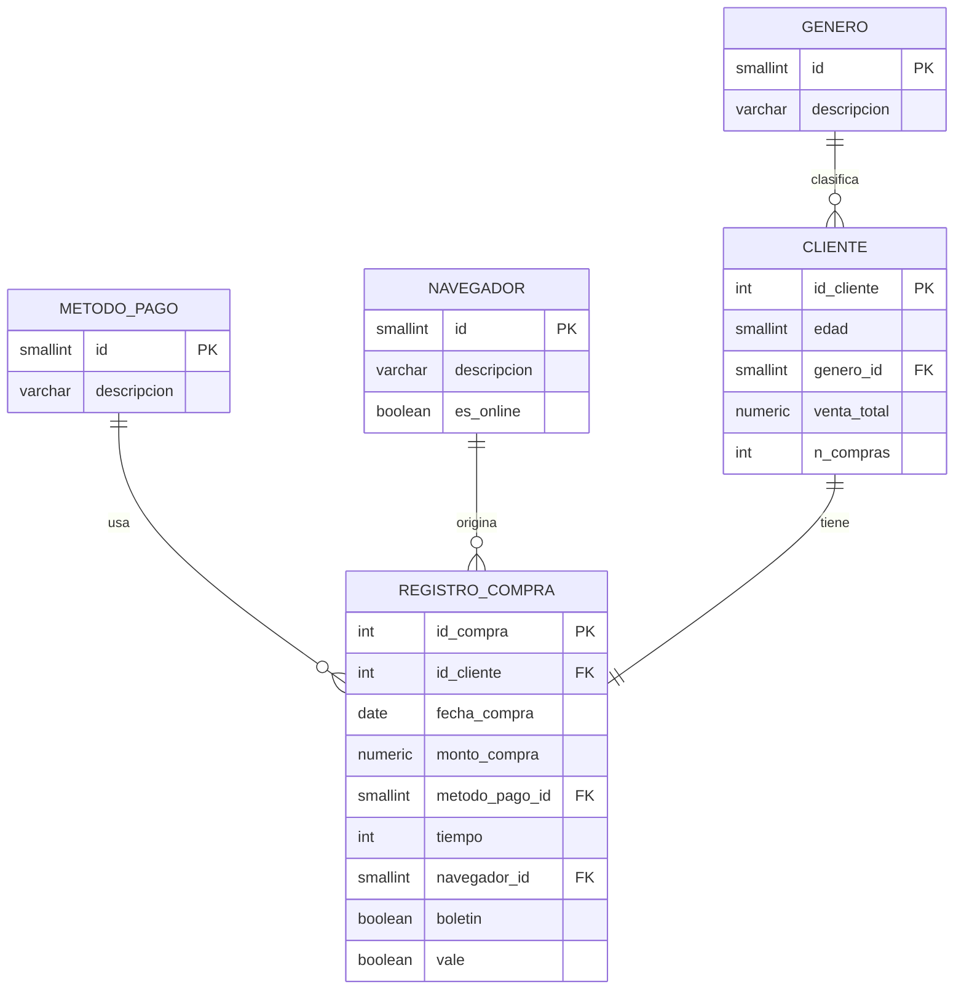

# Guía para armar el informe final

Esto es para quien arme `SOG2-2S26_grupo14.pdf`. Aquí está todo lo que
ya existe en el repo y dónde va cada cosa que pide el enunciado
(sección 4, "Entregables"). Las capturas de las 20 preguntas del
agente ya se mandaron por WhatsApp — no están en el repo.

---

## 1. Cómo correr el proyecto completo

```bash
git clone <url-del-repo>
cd SOG2-2S26_grupo14
pip install -r requirements.txt
```

Necesitas un `.env` en la raíz con dos cosas (pide las credenciales al
equipo, no están en el repo por seguridad):

```
DATABASE_URL=<connection string de Supabase>
GOOGLE_GENAI_USE_VERTEXAI=FALSE
GOOGLE_API_KEY=<api key de https://aistudio.google.com/apikey>
```

Verificar la base:
```bash
python db.py
# debe imprimir: Conexion OK. Clientes en la base: 6500
```

Correr el análisis (imprime resultados y genera gráficos en `graficas/`):
```bash
python analisis_exploratorio.py
python analisis_segmentacion.py
```

Correr el agente conversacional:
```bash
adk web
# abre http://127.0.0.1:8000, elegir "agente" en el dropdown
```

---

## 2. Dónde está cada sección del informe

| Sección pedida | Dónde sacar el contenido |
|---|---|
| **Planificación** | División de roles y cronograma: [GUIA_EQUIPO.md](GUIA_EQUIPO.md) secciones "ROL 1-4" y "8. Cronograma". Herramientas usadas y por qué: sección 4 de este documento. |
| **Proceso de análisis** | Limpieza y preparación: [bitacora_etl.txt](bitacora_etl.txt) (la genera `etl_carga.py`, tiene cada decisión con su motivo). Desafíos encontrados: sección 5 de este documento, ya redactados. |
| **Metodología** (por qué cada visualización) | Sección 3 de este documento, un párrafo por gráfico. |
| **Conclusiones, recomendaciones, respuestas** | Sección 6 de este documento tiene los hallazgos numéricos ya validados como insumo. Cada quien redacta su conclusión (mín. 20 líneas), sus 2 acciones, y su(s) pregunta(s) del punto 8 — reparto en `GUIA_EQUIPO.md` sección 6. |
| **Diagrama de la base de datos** | Sección 7 de este documento (diagrama Mermaid, se puede pegar en [mermaid.live](https://mermaid.live) para exportar como imagen, o casi cualquier editor de Markdown moderno lo renderiza directo). |
| **Código** | `schema.sql`, `db.py`, `perfilado.py`, `etl_carga.py`, `analisis_exploratorio.py`, `analisis_segmentacion.py`, `mcp_server.py`, `agente/agent.py`. |
| **Capturas del chat (15-20 preguntas)** | Ya las tiene quien arma el PDF, mandadas por WhatsApp. Las preguntas usadas están en [agente/preguntas_prueba.md](agente/preguntas_prueba.md) por si hace falta el enunciado exacto de cada una. |

---

## 3. Metodología — por qué cada gráfico

Los 7 gráficos están en `graficas/`, a 150 dpi, títulos y ejes en español.

1. **`ventas_por_mes.png`** (líneas) — una serie temporal (ventas mes a
   mes) se lee mejor como línea que como barras: muestra la tendencia
   y las caídas/picos de un vistazo.
2. **`distribucion_metodo_pago.png`** (barras) — comparar 3 categorías
   discretas; barras es el estándar para eso, no hay orden temporal
   que preservar.
3. **`distribucion_navegador.png`** (barras) — mismo caso, 5
   categorías (incluye Tienda Física).
4. **`boletin_vale_por_mes.png`** (barras agrupadas) — dos series
   categóricas (boletín, vale) cruzadas con el tiempo; agrupar por mes
   permite comparar ambas promociones lado a lado sin apilarlas y
   perder la magnitud real de cada una.
5. **`edad_vs_venta_total.png`** (dispersión + línea de tendencia) —
   dos variables continuas (edad, venta_total): dispersión es lo único
   que muestra si hay o no relación visual antes de correr Pearson.
6. **`comportamiento_edad_genero.png`** (barras agrupadas) — comparar
   una métrica continua (venta_total promedio) entre dos categóricas
   cruzadas (rango de edad × género).
7. **`matriz_correlacion.png`** (mapa de calor) — forma estándar de
   mostrar varias correlaciones a la vez (edad, venta_total,
   monto_compra, n_compras, tiempo) sin una tabla de números sueltos.

---

## 4. Herramientas usadas y por qué (para Planificación)

| Herramienta | Por qué |
|---|---|
| **PostgreSQL en Supabase** | BD relacional en la nube gratuita — cumple el requisito técnico y evita las dos penalizaciones de -20%. |
| **Python (pandas, sqlalchemy, psycopg2)** | ETL y análisis; pandas para limpieza y estadística, sqlalchemy como capa de conexión única (`db.py`) para no saturar el pooler gratuito de Supabase. |
| **matplotlib / seaborn** | Los 7 gráficos requeridos, con salida a PNG reproducible desde código (no capturas de pantalla de un dashboard). |
| **scipy.stats** | Pruebas estadísticas correctas: chi-cuadrado + Cramér's V para categóricas, Pearson para continuas — evita el error metodológico de correlacionar variables categóricas con Pearson. |
| **MCP (`mcp` SDK, servidor propio)** | Expone las funciones de análisis como herramientas tipadas y documentadas en vez de una tool genérica de SQL — evita que el modelo genere consultas inconsistentes o abra una inyección. |
| **Google ADK + Gemini** | Requisito técnico del enunciado (agente conversacional conectado a un MCP server). Se usa Gemini Flash-Lite por ser gratuito con límite de tokens, como recomienda el enunciado. |

---

## 5. Desafíos técnicos encontrados y cómo se resolvieron

Para la parte de "Proceso de análisis" que pide detallar desafíos:

1. **Coma colgante y columna inexistente en `schema.sql`.** El archivo
   original tenía un error de sintaxis en `CREATE TABLE metodo_pago` y
   la vista `v_ventas` referenciaba una columna (`es_contraentrega`)
   que nunca existió en la base real. Se detectó comparando el archivo
   contra las columnas que realmente devuelve la BD desplegada, y se
   corrigió el archivo para que sea reproducible.

2. **Nombres de mes en inglés.** La vista `v_ventas` devuelve
   `nombre_mes` usando `TO_CHAR`, que depende del locale del servidor
   de Supabase (en inglés por defecto), pero el enunciado exige
   títulos y ejes en español. Se resolvió traduciendo el número de mes
   a español directamente en Python (`analisis_exploratorio.py`), sin
   modificar la base de datos.

3. **Conflicto de versiones entre `mcp` y `google-adk`.** Instalar
   `pip install mcp` trae por defecto la versión 2.0.0, que reorganizó
   sus módulos internos (ya no existe `mcp.server.fastmcp`) y rompe la
   importación de `google-adk`, que exige `mcp>=1.24,<2`. Se fijó la
   versión en `requirements.txt` (`mcp<2`) para que no le pase a nadie
   más del equipo.

4. **Modelo de Gemini descontinuado.** `gemini-2.5-flash-lite`, el
   modelo sugerido originalmente, ya no está disponible para API keys
   nuevas de Google AI Studio — Google migró a la familia 3.5. El
   agente se ajustó para usar `gemini-3.5-flash-lite`.

5. **Credenciales expuestas en GitHub.** El archivo `.env` con la
   contraseña real de la base de datos se subió al repositorio por
   error (el `.gitignore` original estaba vacío). Se corrigió el
   `.gitignore` y se sacó `.env` del control de versiones.
   ⚠️ **Pendiente:** la contraseña sigue expuesta en el historial de
   git hasta que alguien con acceso la rote desde el dashboard de
   Supabase — mencionarlo como riesgo conocido si sigue sin resolverse
   al momento de entregar.

---

## 6. Hallazgos ya validados contra la base real (insumo para conclusiones)

Todos estos números salieron de correr las funciones contra los 6,500
registros reales en Supabase — no son estimaciones.

- **54.2% de las transacciones fueron en "Tienda Física"**, en un
  dataset que el enunciado describe como ventas *online* de una
  empresa que aún no tenía sucursal física en 2021. Es el hallazgo más
  fuerte del proyecto para la sección de conclusiones (lo señala
  también `GUIA_EQUIPO.md` sección 4).
- Marzo fue el mes de mayor venta (Q22,994.34 / 569 transacciones),
  noviembre el de menor (Q19,779.24 / 493 transacciones).
- Tarjeta de Crédito domina los pagos (58.88% de las transacciones);
  Efectivo/Contra entrega es apenas 18.57%.
- Edad y venta_total: correlación de Pearson r = -0.0252, p = 0.042.
  Es "estadísticamente significativa" por el tamaño de la muestra
  (6,500), pero el efecto es despreciable — ejemplo directo de "no
  confundir significancia con relevancia".
- Género vs. método de pago: chi-cuadrado no significativo (p = 0.15),
  Cramér's V = 0.024 — sin asociación real.
- Boletín vs. vale: sí hay asociación (p < 0.001, Cramér's V = 0.19,
  débil pero real) — quienes reciben boletín tienden más a usar vale.
- Los clientes con boletín + vale gastan en promedio Q242.57 en
  venta_total, contra Q183.33 los que no usan ninguna promoción — la
  diferencia más grande entre los cuatro grupos de
  `patrones_boletin_vale()`.

---

## 7. Diagrama de la base de datos



Fuente exacta de las tablas: [schema.sql](schema.sql). La relación
`cliente`–`registro_compra` es 1:1 en este dataset (cada cliente tiene
exactamente una compra registrada), por eso `id_cliente` es `UNIQUE`
en `registro_compra` — si en el futuro llega el detalle transaccional
completo, pasa a 1:N sin rediseñar nada.
