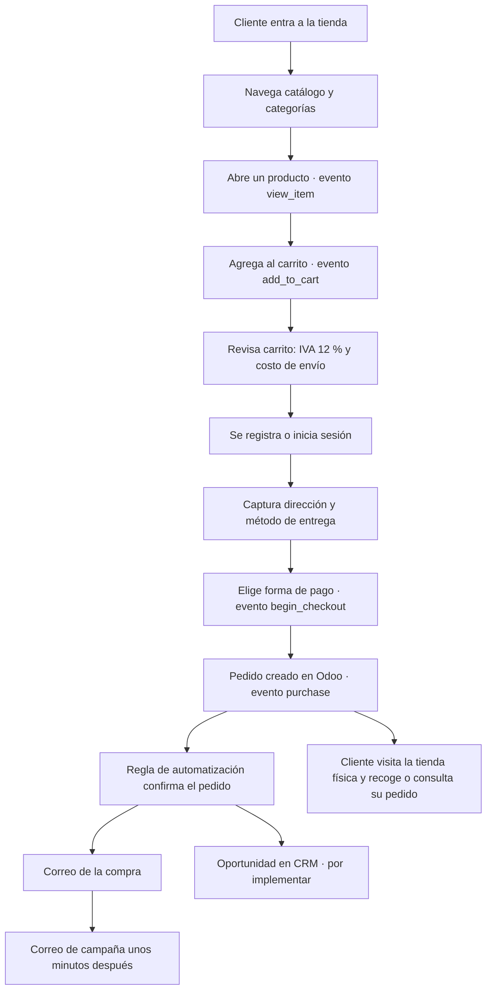
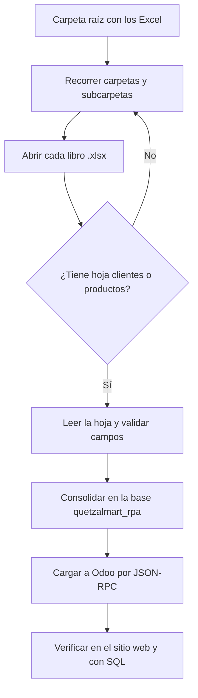

# QuetzalMart · Guía de contexto para redactar los manuales

SOG2 · Grupo 14 · Segundo Semestre 2026. Todo el contenido del repo se escribe en **español**.

Este documento reúne lo que el equipo necesita para escribir los **3 manuales en PDF** que pide el enunciado:
qué es el proyecto, cómo está armado, qué se hizo en cada componente, qué capturas faltan y qué decisiones
conviene explicar. Léelo completo antes de escribir y complétalo con lo que cada quien vaya terminando.

> **Estado al 9 de octubre de 2026.** Lo marcado como "por verificar" no se ha comprobado de punta a punta.
> Actualiza la tabla de la sección 5 cuando cambie algo.

---

## 1. El proyecto en pocas palabras

QuetzalMart es una cadena de supermercados de Guatemala que se expande a México y El Salvador. Tiene cuatro problemas
y cada requisito del enunciado resuelve uno:

| Problema | Solución del proyecto |
|---|---|
| No controla bien ventas, compras, inventario y empleados | ERP **Odoo Community** en la nube |
| Archivos desordenados y dispersos | **Gestor documental** integrado a Odoo (OCA `dms`) |
| Carga manual y repetitiva de datos desde Excel | **RPA con UiPath** que consolida y carga a la base |
| No vende en línea ni mide a sus clientes | **Tienda en línea** + **Google Analytics 4** + **marketing por correo** |

El día de la calificación el auxiliar hará en vivo: ejecutar el RPA con una carpeta de Excel que entrega ese día, registrarse
en la tienda y comprar, recibir primero el **correo de la compra** y después el **correo de campaña** (asuntos distintos y remitente
que no sea el correo personal de un integrante), y pedir ver los datos en la web y por **consulta SQL**.

**Requisito para optar a nota:** los 3 manuales entregados, entrega en UEDI a tiempo, ERP y base de datos en la nube,
consultas SQL preparadas, y que no haya copias.

---

## 2. Arquitectura y decisiones técnicas

| Tema | Decisión | Por qué |
|---|---|---|
| ERP | Odoo **18.0 Community** (imagen Docker `odoo:18.0`) | El enunciado pide Community; la documentación del curso apunta a 18.0 |
| Base de datos | PostgreSQL 16 en el mismo servidor | Odoo solo funciona sobre PostgreSQL. Si se exige otro motor, se replica la información; no se cambia el de Odoo |
| Nube | **AWS Lightsail**, Ubuntu 24.04 con Docker | Cualquier nube sirve. *(El `CLAUDE.md` aún dice DigitalOcean: hay que corregirlo.)* |
| HTTPS | Caddy delante de Odoo, con dominio `<ip-con-guiones>.sslip.io` | Certificado automático sin comprar dominio |
| Sucursales | Una compañía con 3 almacenes: `GT` (central), `MX`, `SV` | Mantiene la operación consolidada para los reportes |
| Localización | Guatemala, moneda GTQ, IVA 12 % | La sede central está en Guatemala |
| Gestor documental | Módulo OCA `dms` | `Documents` es exclusivo de Enterprise |
| Automatizaciones | `base_automation` (Reglas de automatización) | `Marketing Automation` es exclusivo de Enterprise |
| Correo saliente | **Brevo** (SMTP) con remitente de un dominio dedicado | El enunciado prohíbe usar el correo personal de un integrante |
| Analítica | Google Analytics 4 con medición de comercio electrónico | Requisito explícito |
| RPA | UiPath Studio (Windows) → base `quetzalmart_rpa` → Odoo por JSON-RPC | El dato queda visible en la base y en el sitio web |
| Datos masivos | Scripts Python por XML-RPC con **External IDs** `__qm__.*` | Recargar no duplica registros |

**Módulos de Odoo que NO existen en Community** (no los propongan en los manuales): Documents, Marketing Automation,
Studio, Sign, Knowledge y Calidad (Quality).

---

## 3. Qué pide cada manual y de dónde sacar el material

### Manual 1: instalación, módulos, carga masiva y RPA

| Sección | Qué debe contener | Insumos |
|---|---|---|
| 1. Instalación | Cómo instalar el sistema con el que se presenta el proyecto, paso a paso | `infra/README.md`, sección 6 de este documento, `evidencias/infra/` |
| 2. Funcionamiento de cada módulo | Qué hace y cómo se usa: Ventas, Compras, Inventario, Empleados, Facturación, CRM, Sitio web/Comercio electrónico, Gestor documental, Reglas de automatización | `evidencias/<módulo>/` |
| 3. Carga masiva y operación | Capturas de la carga masiva por módulo, y de cómo se generaron órdenes de compra, ventas, manejo de clientes en CRM, administración de empleados y facturas | `datos/README.md`, `evidencias/datos/`, `evidencias/<módulo>/` |
| 4. RPA | Capturas paso a paso de cómo se construyó, qué problema resuelve y **qué ventajas tiene** (texto) | `evidencias/rpa/`, `rpa/` |

### Manual 2: diagramas de flujo (detallados)

Ver la sección 7. Son cinco: UiPath, compras a proveedores, ventas, flujo del producto desde que entra hasta que se vende,
y cliente que compra por la web y visita la tienda.

### Manual 3: inteligencia de negocio con los datos de GA4 (con gráficos)

Ver la sección 8. Depende de que GA4 ya haya recibido tráfico real de la tienda.

---

## 4. Cómo se carga la información (reproducible)

Todo lo que se carga en Odoo debe poder repetirse con un script de `PROYECTO/datos/`. Los scripts son idempotentes
(buscan por External ID antes de crear) y funcionan igual en local y en el servidor, cambiando solo el `.env`.

| Script | Qué hace |
|---|---|
| `01_configurar_erp.py` | Compañía QuetzalMart (GT, GTQ), módulos, plan contable GT con IVA 12 %, diarios, almacenes GT/MX/SV, logo y diseño de documentos |
| `02_datos_maestros.py` | Etiquetas, categorías, proveedores, 60 productos con imagen, 80 clientes |
| `03_empleados.py` | 5 departamentos, 6 cargos, 35 empleados con jefe directo |
| `04_materiales.py` | 60 materiales de operación (no se venden) |
| `05_compras.py` | 100 compras confirmadas, recibidas, facturadas y en su mayoría pagadas |
| `06_ventas.py` | 150 ventas entregadas desde la sucursal del país del cliente y facturadas |
| `07_cotizaciones.py` | 20 cotizaciones (12 a clientes y 8 solicitudes a proveedores) |
| `08_exportar_facturas.py` | Exporta los PDF de las facturas a `facturas_pdf/` |
| `09_gestor_documental.py` | Gestor documental `dms` con carpetas, etiquetas y 15 PDF |
| `10_publicar_tienda.py` | Publica en la tienda los productos vendibles |
| `11_categorias_tienda.py` | Crea las categorías públicas de la tienda a partir de las internas |
| `12_plantillas_correo.py` | Sube las imágenes de los correos y crea las plantillas de compra y campaña |
| `cargar_todo.py` | Ejecuta el 01 al 09 en orden |

Las consultas que demuestran cada requisito están en `sql/consultas_calificacion.sql`, cada una con un comentario del
requisito que comprueba y el resultado esperado.

---

## 5. Estado por componente

| Componente | Estado | Qué falta |
|---|---|---|
| ERP: módulos, compañía, almacenes, impuestos | Hecho | Capturas |
| Datos maestros, empleados, materiales | Hecho | Capturas |
| Ventas, cotizaciones, compras, facturas y 150 PDF | Hecho | Repetir la carga en el servidor si no se hizo; capturas |
| Gestor documental | Hecho | Capturas del filtrado por etiquetas |
| Consultas SQL (secciones 0 a 7) | Hecho | Sección 8 con las consultas del RPA y de la tienda |
| Servidor en la nube (Lightsail) | Odoo funcionando por HTTP | HTTPS con Caddy; corregir `CLAUDE.md` |
| Tienda: catálogo, categorías, carrito, IVA, envío | Hecho | Capturas |
| Pago por transferencia bancaria | Hecho | Decidir si se agrega pago contra entrega y/o Stripe en modo de prueba |
| Confirmación automática del pedido | Hecho (regla de automatización) | Capturas de la regla |
| Plantilla del correo de la compra | Se genera con el diseño nuevo | **Por verificar** que el correo llegue a la bandeja |
| Correo de campaña posterior a la compra | Plantilla lista | **Por verificar** la regla y el retraso |
| Factura por correo | Sin implementar | Decidir si va adjunta al correo de la compra |
| Oportunidad en el CRM al registrarse | Sin implementar | Regla de automatización |
| Google Analytics 4 | Sin empezar | Propiedad, eventos, segmentos, exploraciones, audiencias |
| RPA con UiPath | Sin empezar | Robot, generador de Excel de prueba, carga a la base |
| Manuales 1, 2 y 3 | Sin empezar | Este documento es el insumo |

---

## 6. Instalación paso a paso (para la sección 1 del Manual 1)

Confirmen los detalles del servidor con quien lo montó; lo siguiente describe lo que se hizo en el repo y en Odoo.

1. **Servidor:** instancia de Lightsail con Ubuntu 24.04 y Docker. Abrir en el firewall los puertos 22 (SSH), 80 y 443 (HTTPS) y, mientras no haya HTTPS, el 8069.
2. **Acceso SSH:** cada integrante genera su propia llave (`ssh-keygen -t ed25519`) y entrega **solo la pública** para que la agreguen al servidor.
3. **Repositorio:** clonar y entrar a `PROYECTO/infra`.
4. **Configuración:** `cp .env.example .env` y `cp config/odoo.conf.example config/odoo.conf` (cambiar `admin_passwd`; en local, `workers = 0`).
5. **Módulos OCA:** `sh obtener_addons.sh`.
6. **Base de datos:** `docker compose up -d db`.
7. **Crear la base una sola vez, sin datos de demostración y en español:**
   `docker compose run --rm odoo odoo -d quetzalmart -i base --without-demo=all --load-language=es_419 --stop-after-init`
8. **Levantar:** `docker compose up -d` (con `--profile prod` en el servidor para agregar Caddy y HTTPS).
9. **Cargar datos** desde `PROYECTO/datos`: `cp .env.example .env`, ajustar, y `python3 -X utf8 cargar_todo.py` (unos 15 minutos).
10. **Después de la carga:** instalar **Comercio electrónico** y **Envío**, y correr `10_publicar_tienda.py`, `11_categorias_tienda.py` y `12_plantillas_correo.py "<Nombre> <correo-verificado-en-Brevo>"`.
11. **Cambiar la contraseña `admin`** de Odoo.

**El orden importa.** Si se instala Comercio electrónico *antes* de `cargar_todo.py`, Odoo instala Contabilidad sin el plan
contable de Guatemala y el paso 01 falla con `try_loading() missing 1 required positional argument: 'company'`.
La solución es borrar la base y repetir desde el paso 7.

---

## 7. Diagramas de flujo para el Manual 2

Cada diagrama debe ser detallado: quién actúa, qué pantalla de Odoo se usa y qué decisiones hay. Se pueden dibujar en
draw.io o en Mermaid (GitHub los muestra directamente).

### 7.1 Flujo del cliente que compra por la web

Agreguen la rama de **carrito abandonado** (el cliente sale entre D y H) y, si la implementan, la de **factura adjunta**.

### 7.2 Flujo del RPA con UiPath

El criterio es **el nombre de la hoja**, no el de la carpeta ni el del archivo. Campos de `clientes`: Name, Company Type,
Related Company, Email, Phone, Street, Street2, City, State, Zip, Country, Tax ID, Website, Tags, Reference, Notes.
Campos de `productos`: ID Externo, Name, Product Type, Internal Reference, Barcode, Sales Price, Cost, Weight,
Sales Description, Product Values, Cantidad a la mano, Está publicado.

### 7.3 Compras a proveedores

Solicitud de presupuesto (cotización al proveedor) → confirmar como orden de compra → recepción de la mercancía en el
almacén de la sucursal → registro de la factura del proveedor (pago a 30 días) → pago. Indiquen en cada paso la pantalla de Odoo y
los casos de excepción (proveedor rechaza, recepción parcial, mercancía dañada).

### 7.4 Ventas de productos

Cotización al cliente → confirmación → entrega desde la sucursal del país del cliente → factura de cliente (PDF) → cobro.
Incluyan el descuento de inventario y qué pasa si no hay existencias.

### 7.5 Del ingreso del producto hasta la venta

Debe cubrir, en este orden: **recepción del producto → almacenamiento (según su sector) → productos defectuosos o en mal
estado → control de inventario → empaque → control de calidad para ponerlo a la venta**.

Odoo Community **no incluye** el módulo de Calidad. Descríbanlo como un paso del procedimiento (lista de verificación) y
usen las funciones que sí existen: ubicaciones de almacén, devolución o desecho (*scrap*) para los defectuosos y ajustes de inventario.

---

## 8. Manual 3: inteligencia de negocio con GA4

Lo que pide el enunciado y debe aparecer **con gráficos**:

- Eventos registrados: `view_item`, `add_to_cart`, `begin_checkout`, `purchase`.
- Indicadores: tasa de conversión, adquisición de usuarios, total de ingresos, productos más vendidos y abandono de carrito.
- **3 segmentos de usuarios** y **5 segmentos de eventos**.
- **2 informes de exploración** construidos con esos segmentos.
- **3 audiencias** (al menos 1 personalizada).

Para que haya datos que graficar: GA4 necesita tráfico real, y los informes estándar pueden tardar 24 a 48 horas en procesarse
(el informe en tiempo real es inmediato). **Generen compras de prueba desde ya**, con variedad de productos, abandonos de carrito
y distintos dispositivos, y no el día antes de la entrega. Tengan en cuenta que en la calificación se deben mostrar los datos que
capturó el auxiliar.

Cada gráfico debe ir con una **lectura de negocio**: qué dice el dato y qué decisión propone (por ejemplo, dónde se pierde el
cliente en el embudo y qué cambiar en la tienda).

---

## 9. Configuración hecha con clics (no viaja con git)

Esto vive en la base de datos. Hay que **documentarlo con capturas** y repetirlo en el servidor.

| Qué | Dónde | Notas |
|---|---|---|
| Comercio electrónico y Envío | Aplicaciones | Instalar **después** de `cargar_todo.py` |
| Método de envío "Envío estándar" (tarifa fija) | Inventario → Configuración → Métodos de envío | Aparece en el carrito |
| Proveedor de pago "Transferencia bancaria" | Facturación → Configuración → Proveedores de pago | Con cuenta ficticia de QuetzalMart y texto propio. Dejar **Demostración sin instalar** |
| Registro de clientes | Sitio web → Configuración → Ajustes → Cuenta de cliente | Registro libre; inicio de sesión obligatorio al pagar |
| Servidor de correo saliente (Brevo) | Ajustes → Técnico → Correo → Servidores de correo saliente | Puerto 587, TLS; usuario y clave SMTP de Brevo. **Nunca publicar la clave** |
| Dirección pública del sitio | Ajustes → Técnico → Parámetros del sistema | `web.base.url` y `web.base.url.freeze = True` (este último se crea a mano) |
| Regla "Confirmar pedidos de la tienda" | Ajustes → Técnico → Automatización | Se activa cuando el estado pasa a *Cotización enviada*, solo en pedidos con sitio web: `records.with_context(send_email=True).action_confirm()` |
| Regla de campaña posterior a la compra | Ídem | Se activa al pasar a *Orden de venta*; envía la plantilla de campaña con unos minutos de retraso |
| Plantillas de correo | Creadas por `12_plantillas_correo.py` | HTML en `marketing/plantillas/`, imágenes en `marketing/imagenes/` |
| Diseño del sitio (logo, colores, banner) | Editor del sitio web | Colores de marca `#0B7A4B` (verde) y `#C8102E` (rojo) |

Para activar el modo desarrollador, agregar `?debug=1` a la dirección del panel (por ejemplo `/odoo?debug=1`).

---

## 10. Evidencias: qué capturar y cómo guardarlo

Regla del repo: **si no hay captura, no existe para el manual.** Guarden las capturas en `PROYECTO/evidencias/<componente>/`,
numeradas (`01-instalar-modulo.png`, `02-...`), con un `NOTAS.md` que liste los pasos en orden.

| Carpeta | Capturas mínimas |
|---|---|
| `infra/` | Instancia en Lightsail, firewall, SSH, `docker compose ps`, Odoo por HTTPS |
| `datos/` | Salida de `cargar_todo.py`, conteos por consulta SQL |
| `ventas/` y `compras/` | Lista de órdenes, una orden abierta, facturas, PDF de factura |
| `empleados/` | Lista, departamentos, cargos |
| `crm/` | Clientes, oportunidades, la regla de automatización |
| `dms/` | Carpetas, documentos y filtrado por etiquetas |
| `web/` | Tienda, categorías, producto, carrito, pago, "Gracias por tu orden", pantalla de ajustes de pago y envío |
| `mkt/` | Servidor de correo, plantillas, reglas, **los dos correos recibidos en la bandeja** |
| `ga4/` | Propiedad, flujo de datos, eventos, segmentos, exploraciones, audiencias, reportes |
| `rpa/` | Cada actividad del robot, la ejecución, el resultado en el sitio web y en SQL |

**Antes de subir capturas:** tapen o recorten direcciones IP, llaves, contraseñas, claves SMTP y correos personales.

---

## 11. Problemas que ya ocurrieron (sirven como sección de lecciones aprendidas)

| Síntoma | Causa | Solución |
|---|---|---|
| `try_loading() missing ... 'company'` al correr el paso 01 | Se instaló Comercio electrónico antes de cargar los datos | Borrar la base y repetir desde la creación |
| "The database manager has been disabled" | `odoo.conf` lo desactiva a propósito | Crear y borrar bases por terminal con `psql` |
| Cada llamada tarda unos 2 segundos en Windows | `localhost` intenta IPv6 primero | Usar `http://127.0.0.1:8069` en el `.env` |
| Acentos mal escritos en Windows | Codificación de la consola | `python -X utf8 <script>` |
| El filtro de la tienda solo muestra "Todos los productos" | Las categorías internas no son las de la tienda | Script `11_categorias_tienda.py` |
| El checkout solo muestra un método de pago | Al duplicar un proveedor, ambos comparten el mismo método | Dejar un proveedor por método |
| No existe la opción de plantilla de confirmación en Ajustes de Ventas | Esta versión no la incluye | `12_plantillas_correo.py` también actualiza la plantilla estándar de confirmación |
| Logo y enlaces del correo apuntan a `127.0.0.1` | `web.base.url` mal configurado | Ponerlo con la dirección pública y crear `web.base.url.freeze` |
| Correos "timed out" | El puerto 25 está bloqueado en la nube | Usar 587 con TLS |
| Los pedidos nuevos no aparecen en Cotizaciones | La vista abre con el filtro "Mis cotizaciones" y el pedido web no tiene vendedor | Quitar el filtro |

---

## 12. Reglas del repositorio

- Cada componente se trabaja en su rama (`web/...`, `mkt/...`, `ga4/...`, `rpa/...`, `docs/...`) y se integra por Pull Request. `main` siempre debe levantar.
- Commits en español, imperativo, máximo 72 caracteres: `tipo(alcance): descripción`.
- **Secretos:** `.env`, `odoo.conf`, claves SMTP, llaves de API y de GA4 **nunca se suben**.
- Actualicen la tabla de estado del `CLAUDE.md` en el mismo commit que completa un componente.
- No hay copias parciales ni totales: cada manual debe estar escrito con el trabajo real del equipo.

---

## 13. Pendientes y responsables

| Pendiente | Responsable | Fecha |
|---|---|---|
| Verificar que el correo de la compra llega a la bandeja | | |
| Verificar la regla de campaña | | |
| Factura por correo | | |
| Oportunidad en CRM al registrarse | | |
| HTTPS con Caddy y dominio definitivo | | |
| Corregir `CLAUDE.md` (dice DigitalOcean; es AWS Lightsail) | | |
| Google Analytics 4 completo | | |
| RPA con UiPath | | |
| Sección 8 de `consultas_calificacion.sql` | | |
| Manual 1 | | |
| Manual 2 | | |
| Manual 3 | | |
| Entrega en UEDI | | |
