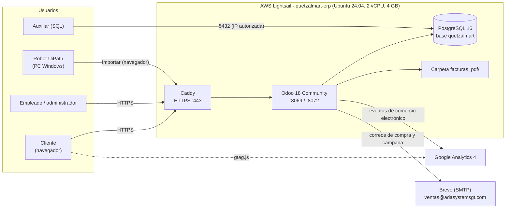
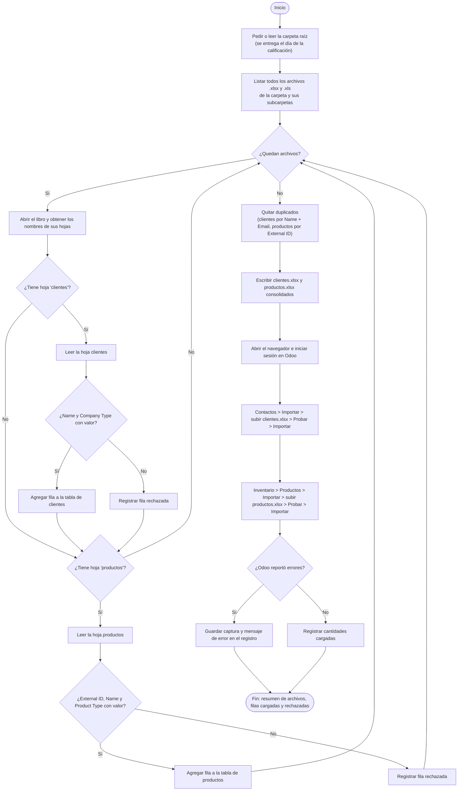
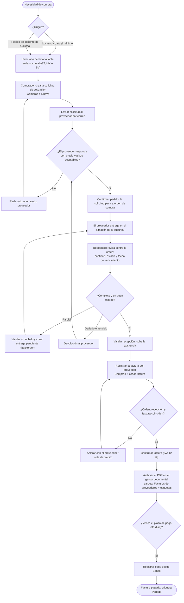
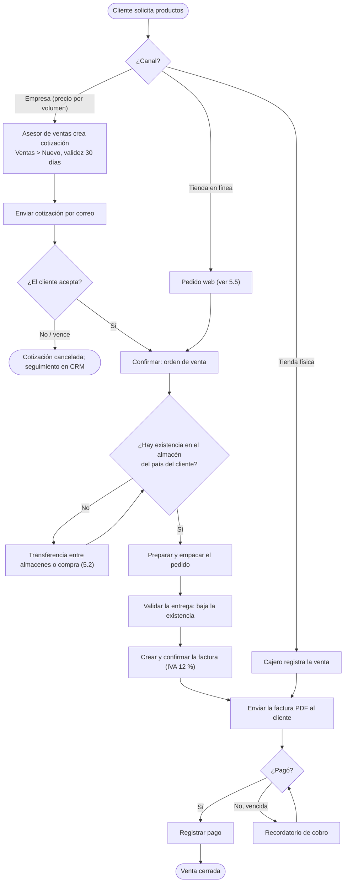
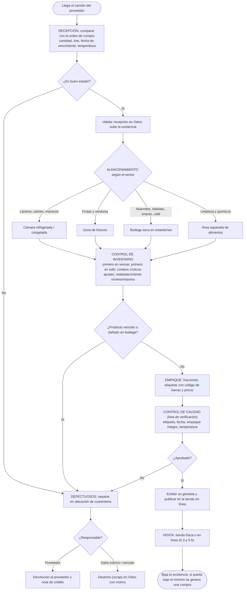
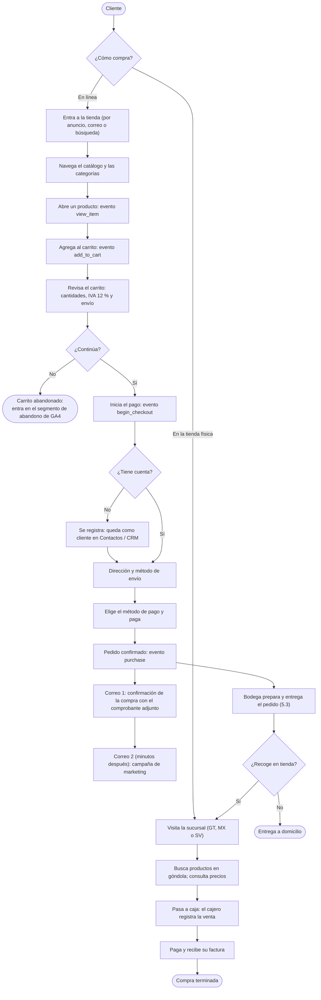

# QuetzalMart · Guía completa para redactar los 3 manuales

SOG2 · Grupo 14 · Segundo Semestre 2026. Todo se escribe en **español**.

Este documento tiene todo lo que necesita quien redacte los manuales: qué pide cada sección y cuántos puntos vale,
los datos reales del proyecto (verificados en el servidor el **9 de octubre de 2026**), el texto base de cada parte,
los diagramas en borrador y la lista de capturas que ya existen y las que faltan.
Si algo cambia, actualicen aquí la sección correspondiente.

**Contenido**

1. [Qué se entrega y cómo se califica](#1-qué-se-entrega-y-cómo-se-califica)
2. [Datos generales (portada y referencias)](#2-datos-generales-portada-y-referencias)
3. [El proyecto, la arquitectura y las decisiones](#3-el-proyecto-la-arquitectura-y-las-decisiones)
4. [Manual 1: instalación, módulos, carga masiva y RPA](#4-manual-1-instalación-módulos-carga-masiva-y-rpa)
5. [Manual 2: diagramas de flujo](#5-manual-2-diagramas-de-flujo)
6. [Manual 3: inteligencia de negocio con GA4](#6-manual-3-inteligencia-de-negocio-con-ga4)
7. [Inventario de capturas](#7-inventario-de-capturas)
8. [Configuración hecha en pantalla (no está en scripts)](#8-configuración-hecha-en-pantalla-no-está-en-scripts)
9. [Problemas encontrados y lecciones aprendidas](#9-problemas-encontrados-y-lecciones-aprendidas)
10. [Lo que todavía va a cambiar](#10-lo-que-todavía-va-a-cambiar)
11. [Reglas de estilo y de seguridad](#11-reglas-de-estilo-y-de-seguridad)

---

## 1. Qué se entrega y cómo se califica

**Entrega en UEDI:** un archivo **`.zip`** con los **3 manuales en PDF** (respuesta del auxiliar en el foro *Entrega*).
El **enlace de Odoo** va en el Manual 1, en la parte de los módulos instalados.

**Requisitos para optar a nota** (si falta uno, la nota es 0): los 3 manuales entregados, entrega a tiempo en UEDI,
ERP en la nube, consultas SQL preparadas con la base en la nube, y que no haya copias.

**Rúbrica de los manuales: 30 de 100 puntos**

| # | Criterio | Puntos | Qué tiene que verse |
|---|---|---|---|
| 2.01 | Manual 1 | 5 | Presentable y con **todas** las secciones |
| 2.02 | Manual 1 · sección 1 | 1 | Instalación detallada del sistema con el que se presenta |
| 2.03 | Manual 1 · sección 2 | 1 | Funcionamiento de cada módulo |
| 2.04 | Manual 1 · sección 3 | 1 | Pasos y capturas de: carga masiva **de cada módulo**, órdenes de compra, ventas, manejo de clientes en **CRM**, administración de empleados, generación de facturas |
| 2.05 | Manual 1 · sección 4 | 1 | Capturas paso a paso de cómo se hizo el RPA y **ventajas** de implementarlo (texto) |
| 2.06 | Manual 2 | 5 | Presentable y con todas las secciones |
| 2.07 | Manual 2 · diagrama UiPath | 2 | Diagrama de flujo de lo que hace el robot |
| 2.08 | Manual 2 · compras a proveedores | 3 | Diagrama **detallado** |
| 2.09 | Manual 2 · flujo de productos | 3 | Desde la recepción hasta la venta, con los 6 puntos del enunciado |
| 2.10 | Manual 3 | 5 | Presentable y con todas las secciones |
| 2.11 | Manual 3 · inteligencia de negocios | 3 | Análisis con datos de GA4 **y gráficos** |

El enunciado también pide en el Manual 2 el diagrama de **ventas** y el del **cliente que compra por la web y visita la tienda**.
La rúbrica no les asigna puntos propios, pero entran en "todas las secciones" (2.06): inclúyanlos.

---

## 2. Datos generales (portada y referencias)

| Dato | Valor |
|---|---|
| Universidad | Universidad de San Carlos de Guatemala, Facultad de Ingeniería, Escuela de Ciencias y Sistemas |
| Curso | Sistemas Organizacionales y Gerenciales 2 · Laboratorio |
| Catedrático | Ing. Mario José Bautista Fuentes |
| Auxiliar | William Alexander Santos Colindres |
| Proyecto | Proyecto único · QuetzalMart · Segundo Semestre 2026 |
| Grupo | 14 |

| Carné | Integrante |
|---|---|
| 202001814 | Naomi Rashel Yos Cujcuj |
| 202200252 | Néstor Enrique Villatoro Avendaño |
| 202202882 | Diego René Chen Teyul |
| 202200309 | Eduardo Angel Tubac Simón |
| 202103763 | Jennifer Yulissa Lourdes Taperio Manuel |
| 202200041 | Daniel Eduardo Velasquez Avila |

| Recurso | Dónde |
|---|---|
| Sitio y ERP | `https://<ip-con-guiones>.sslip.io` (tienda en `/shop`, administración en `/odoo`). La IP está en el mensaje del servidor que se compartió en el grupo y en `PROYECTO/infra/.env` del servidor (`DOMAIN`) |
| Base de datos | PostgreSQL 16 en el mismo servidor, base `quetzalmart`, puerto 5432 (solo IPs autorizadas) |
| Consultas de la calificación | `PROYECTO/sql/consultas_calificacion.sql` |
| Repositorio | `https://github.com/NaomiYos/SOG2-2S26_grupo14` |
| Enunciado, rúbrica y foro | `PROYECTO/enunciado/` |

Para que el auxiliar pueda "acceder y hacer login" (rúbrica, 5 pts), pongan en el Manual 1 el enlace y **un usuario de
demostración**, no la contraseña del administrador. Pídanle a quien administra Odoo que cree ese usuario.

---

## 3. El proyecto, la arquitectura y las decisiones

### 3.1 El problema en pocas palabras (para la introducción de cada manual)

QuetzalMart es una cadena de supermercados nacida en Guatemala que en un año abrió dos sucursales, en **México** y **El Salvador**.
Vende alimentos, bebidas y artículos de uso diario a precios accesibles. Al crecer aparecieron cuatro problemas,
y cada parte del proyecto resuelve uno:

| Problema | Solución |
|---|---|
| Mucho volumen de ventas, compras e inventario repartido en 3 países, sin información consolidada | ERP **Odoo 18 Community** en la nube, una compañía con 3 almacenes |
| Archivos críticos dispersos, riesgo de pérdida e incumplimiento normativo | **Gestor documental** integrado a Odoo (módulo OCA `dms`) con carpetas y etiquetas |
| Carga manual y repetitiva de clientes y productos desde Excel | **RPA con UiPath** que recorre las carpetas, consolida y carga |
| No vende en línea ni conoce el comportamiento de sus clientes | **Tienda en línea** + **Google Analytics 4** + **campaña de correo** |

### 3.2 Arquitectura

### 3.3 Decisiones técnicas y su justificación

| Tema | Decisión | Por qué |
|---|---|---|
| ERP | Odoo **18.0 Community**, imagen Docker oficial `odoo:18.0` | El enunciado pide Odoo Community; la documentación del curso es de la 18.0 |
| Base de datos | PostgreSQL 16 en el mismo servidor | Es la única base que soporta Odoo y la que recomienda el auxiliar (foro *Proyecto DB*); una sola base, todo centralizado |
| Nube | AWS Lightsail, región Virginia, IP estática | Simple, precio fijo y cubierto por los créditos de AWS |
| Despliegue | Docker Compose con 3 contenedores: Odoo, PostgreSQL y Caddy | Se levanta igual en local y en el servidor; reproducible |
| HTTPS | Caddy con dominio `<ip-con-guiones>.sslip.io` | Certificado Let's Encrypt automático sin comprar dominio |
| Sucursales | Una compañía con 3 almacenes: `GT` (central), `MX` y `SV` | Aceptado por el auxiliar; los reportes salen consolidados |
| Localización | Guatemala, moneda GTQ, plan contable `l10n_gt`, IVA 12 % | La sede central está en Guatemala |
| Gestor documental | Módulo OCA `dms` | `Documents` es exclusivo de Odoo Enterprise |
| Automatización | Reglas de automatización (`base_automation`) | `Marketing Automation` es exclusivo de Enterprise |
| Correo saliente | Brevo por SMTP (puerto 587, TLS) con el dominio `adasystemsgt.com` autenticado (DKIM y DMARC) | El auxiliar no permite cuentas de Gmail/Outlook creadas para el proyecto ni el correo personal de un integrante; con dominio autenticado los correos llegan a buzones como temp-mail.org |
| Analítica | GA4 con medición de comercio electrónico + módulo propio `qm_ga4_ecommerce` | Odoo 18 solo emite `view_item`, `add_to_cart` y `purchase`; el módulo agrega `begin_checkout` y los eventos del carrito |
| RPA | UiPath Studio con la pantalla **Importar** de Odoo | El auxiliar prohibió usar la API de Odoo desde UiPath |
| Datos masivos | Scripts Python por XML-RPC con External IDs `__qm__.*` | Se pueden volver a ejecutar sin duplicar datos |

**Módulos que NO existen en Community** (no los mencionen como usados): Documents, Marketing Automation, Studio, Sign,
Knowledge y Calidad (Quality).

---

## 4. Manual 1: instalación, módulos, carga masiva y RPA

Estructura sugerida: portada · índice · introducción (3.1) · arquitectura (3.2 y 3.3) · secciones 1 a 4 · conclusiones.

### 4.1 Sección 1: instalación del sistema (1 pt)

Material completo: `evidencias/nube/NOTAS.md` (10 capturas) y `evidencias/instalacion/NOTAS.md` (11 capturas), más `PROYECTO/infra/README.md`.
Pasos a narrar, en este orden:

| # | Paso | Detalle | Captura |
|---|---|---|---|
| 1 | Cuenta de AWS y créditos | Presupuesto con alerta por correo | `nube/01`, `nube/02` |
| 2 | Crear la instancia | Lightsail > Create instance: Linux, Ubuntu 24.04 LTS, script de arranque que instala Docker, llave SSH, plan 2 vCPU / 4 GB / 80 GB, nombre `quetzalmart-erp` | `nube/03` a `nube/07` |
| 3 | IP estática y firewall | 80 y 443 abiertos; 22 solo con llave; 5432 solo IPs del equipo | `nube/08`, `nube/09` |
| 4 | Entrar por SSH | `ssh ubuntu@<ip>`; comprobar `docker --version` | `nube/10` |
| 5 | Memoria de intercambio | 2 GB de swap para que Odoo no se caiga al generar PDF | `instalacion/01` |
| 6 | Clonar el repositorio | `git clone ...` en `~/SOG2-2S26_grupo14` | `instalacion/02` |
| 7 | Configuración | `.env` (usuario y contraseña de PostgreSQL, `PG_BIND=0.0.0.0`, `DOMAIN`) y `config/odoo.conf` (`workers = 2`, `proxy_mode`, `list_db = False`) | `instalacion/03`, `04` |
| 8 | Módulos OCA | `sh obtener_addons.sh` descarga `dms` en una versión fija | `instalacion/05` |
| 9 | Crear la base | `docker compose run --rm odoo odoo -d quetzalmart -i base --without-demo=all --load-language=es_419 --stop-after-init` | `instalacion/06` |
| 10 | Levantar | `docker compose --profile prod up -d`; los 3 contenedores en ejecución | `instalacion/07` |
| 11 | HTTPS | Odoo en `https://<ip-con-guiones>.sslip.io` con certificado válido | `instalacion/08` |
| 12 | Primer ingreso y contraseña | `admin`/`admin` y cambio inmediato de contraseña | `instalacion/09`, `10` |
| 13 | Base accesible desde fuera | DBeaver o `psql` desde una PC del equipo | `instalacion/11` |
| 14 | Carga de datos | Ver 4.3 | `carga_masiva/01`, `02` |
| 15 | Tienda y correo | Instalar Comercio electrónico y Envío **después** de la carga, publicar productos, plantillas de correo | Ver 4.2 y sección 8 |

Datos del servidor para el texto: Ubuntu 24.04 LTS, 2 vCPU, 4 GB de RAM, 80 GB SSD, región `us-east-1`, Docker Compose,
Odoo 18.0, PostgreSQL 16, Caddy 2. Respaldo: `pg_dump` de la base y copia de los adjuntos en `~/respaldos/`.

### 4.2 Sección 2: funcionamiento de cada módulo (1 pt)

Aquí va el **enlace de Odoo**. Para cada módulo: para qué lo usa QuetzalMart, qué datos tiene y los menús principales,
con una captura (lista en `evidencias/modulos/NOTAS.md`).

Módulos instalados en el servidor (verificado):

| Módulo (nombre técnico) | Qué hace en QuetzalMart | Datos cargados | Menú |
|---|---|---|---|
| Ventas (`sale_management`) | Cotizaciones, órdenes de venta, entregas y facturación al cliente | 158 ventas confirmadas (150 cargadas + pedidos web), cotizaciones a clientes | Ventas > Órdenes |
| CRM (`crm`, `sale_crm`, `website_crm`) | Oportunidades de venta, seguimiento de clientes | **Pendiente**: hoy no hay oportunidades (ver sección 10) | CRM > Ventas > Mi flujo |
| Compras (`purchase`) | Solicitudes de cotización, órdenes de compra, recepción y factura de proveedor | 100 compras confirmadas, recibidas y facturadas (abr-sep 2026), solicitudes a proveedores | Compras > Órdenes |
| Inventario (`stock`) | 3 almacenes (GT, MX, SV), recepciones, entregas, existencias | Existencias de 60 productos y 60 materiales por sucursal | Inventario > Resumen |
| Facturación (`account`, `l10n_gt`) | Plan contable de Guatemala, IVA 12 %, facturas de cliente y proveedor, pagos | 150 facturas de cliente, 100 de proveedor | Facturación > Clientes / Proveedores |
| Empleados (`hr`) | Departamentos, cargos, jefes directos, lugar de trabajo | 35 empleados, 6 cargos, 5 departamentos | Empleados |
| Contactos (`contacts`) | Clientes, proveedores y empresas de outsourcing con etiquetas | 80 clientes (60 personas, 20 empresas), 14 proveedores, 5 empresas de outsourcing | Contactos |
| Sitio web y Comercio electrónico (`website`, `website_sale`, `website_sale_stock`, `delivery`) | Tienda en línea con catálogo, carrito, IVA, envío y pago | 60 productos publicados con imagen, descripción y precio; envío estándar Q30; transferencia bancaria | Sitio web |
| Pagos (`payment_custom`) | Método de pago "Transferencia bancaria" | — | Facturación > Configuración > Proveedores de pago |
| Reglas de automatización (`base_automation`) | Confirma los pedidos web y programa el correo de campaña | Regla "Confirmar pedidos de la tienda" | Ajustes > Técnico > Automatización |
| Gestor documental (OCA `dms`) | Carpetas, documentos y etiquetas para filtrar | 15 documentos en 3 carpetas, 12 etiquetas en 4 categorías | Documentos |
| `qm_ga4_ecommerce` (módulo propio) | Completa los eventos de GA4 que Odoo no emite (`begin_checkout`, `view_cart`, `remove_from_cart`, ...) | — | Aplicaciones, buscar `qm_ga4` |

Detalle de los datos (para describir los módulos con ejemplos reales):

- **Almacenes**: QuetzalMart Guatemala (`GT`, 6a. Avenida 10-25, Zona 1), QuetzalMart México (`MX`, Av. Insurgentes Sur 1458, CDMX), QuetzalMart El Salvador (`SV`, Blvd. de Los Héroes 1120, San Salvador).
- **Categorías de productos (10)**: Abarrotes, Bebidas, Lácteos y huevos, Panadería, Carnes y mariscos, Frutas y verduras, Snacks y dulces, Limpieza del hogar, Cuidado personal, Café y desayuno. Códigos `QM-...`, código de barras EAN-13 con prefijo 740 (Guatemala).
- **Materiales de operación (60, no se venden)**, códigos `MAT-...`: Empaque y despacho, Caja y oficina, Limpieza institucional, Equipo y mantenimiento, Uniformes y seguridad.
- **Proveedores (14)**: 10 de mercadería (por ejemplo Distribuidora La Cosecha, Embotelladora del Pacífico, Lácteos Los Altos, Cárnicos de Centroamérica de El Salvador, Dulces y Botanas del Norte de México) y 4 de materiales.
- **Departamentos (5)**: Administración, Ventas, Compras, Logística e Inventario, Recursos Humanos.
- **Cargos (6)**: Gerente de Sucursal, Cajero(a), Asesor(a) de Ventas, Comprador(a), Bodeguero(a), Analista de Recursos Humanos.
- **Outsourcing (5)**: Seguridad Integral Centinela, Limpieza Profesional Brillo, Transportes Rápidos del Sur, Maya Tech Soporte Informático, Pérez & Ruiz Contadores Asociados.
- **Gestor documental**: carpetas *Facturas de proveedores*, *Contratos de outsourcing* y *Contratos de empleados*; etiquetas por *Tipo de documento* (Factura de proveedor, Contrato de outsourcing, Contrato laboral), *Sucursal* (Guatemala, México, El Salvador), *Área* (Compras, Operaciones, Recursos Humanos) y *Estado* (Pagada, Pendiente de pago, Vigente). Cada documento también está adjunto a su factura, empleado o empresa en el ERP.
- **Tienda**: los precios se muestran con IVA incluido; el carrito desglosa el IVA y el costo de envío; es obligatorio iniciar sesión o registrarse para pagar.
- **Correos**: al confirmarse un pedido web llega "¡Gracias por tu compra en QuetzalMart! Pedido S0xxxx" con el PDF del pedido adjunto, y unos 3 minutos después la campaña "Tu súper favorito te espera en QuetzalMart". Remitente `ventas@adasystemsgt.com`.

### 4.3 Sección 3: carga masiva y operación de cada módulo (1 pt)

**Cómo se cargó todo**: scripts de Python en `PROYECTO/datos/` (explicados en `PROYECTO/datos/README.md`) que usan XML-RPC
y External IDs, por lo que se pueden ejecutar varias veces sin duplicar. Se corrieron en el servidor con `python3 cargar_todo.py`
(25 minutos). Las capturas de la carga están en `evidencias/carga_masiva/` (ver su `NOTAS.md`).

| Módulo | Script | Qué carga | Captura de la carga | Captura del resultado |
|---|---|---|---|---|
| Configuración | `01_configurar_erp.py` | Compañía, módulos, plan contable, IVA, almacenes, logo | `carga_masiva/01` | `modulos/05` (falta) |
| Productos, clientes, proveedores | `02_datos_maestros.py` | 60 productos con imagen, 80 clientes, 14 proveedores | `carga_masiva/01` | `carga_masiva/09` |
| Empleados | `03_empleados.py` | 5 departamentos, 6 cargos, 35 empleados | `carga_masiva/01` | `carga_masiva/10` |
| Materiales | `04_materiales.py` | 60 materiales | `carga_masiva/01` | `carga_masiva/08` |
| Compras | `05_compras.py` | 100 compras confirmadas, recibidas y facturadas | `carga_masiva/02` | `carga_masiva/07` |
| Ventas | `06_ventas.py` | 150 ventas entregadas y facturadas | `carga_masiva/02` | `carga_masiva/05` |
| Cotizaciones | `07_cotizaciones.py` | 20 a clientes y 20 a proveedores | `carga_masiva/02` | `carga_masiva/06`, `06b` (**repetir**: hoy muestran 12 y 8) |
| Facturas PDF | `08_exportar_facturas.py` | 150 PDF en `facturas_pdf/` | `carga_masiva/04` | `carga_masiva/11` |
| Gestor documental | `09_gestor_documental.py` | 15 documentos, carpetas y etiquetas | `carga_masiva/02` | `modulos/11`, `12` (faltan) |
| Tienda | `10_publicar_tienda.py`, `11_categorias_tienda.py` | Publica los 60 productos y crea las categorías | `publicar_prod.png`, `prod_pub.png`, `publicacionproductos.png` (sueltas en `evidencias/`) | Falta captura del catálogo |
| Correos | `12_plantillas_correo.py` | Plantillas de compra y campaña | `plantillacorreos.png` (las imágenes salen rotas: **repetir** con la vista previa en el servidor) | Faltan los correos recibidos |
| Comprobación | `sql/consultas_calificacion.sql` | Resumen en CUMPLE | `carga_masiva/03` (**repetir** cuando las cotizaciones estén en 20 y 20) | — |

Además de la carga, la rúbrica pide **cómo se generan** estas operaciones en pantalla. Capturen un ejemplo de cada una,
paso a paso (faltan todas; guardarlas en `evidencias/operacion/`):

| Operación | Pasos en Odoo |
|---|---|
| Orden de compra | Compras > Nuevo > proveedor y productos > *Enviar por correo* (solicitud) > *Confirmar pedido* > botón *Recepción* > *Validar* > *Crear factura* > *Confirmar* > *Registrar pago* |
| Venta | Ventas > Nuevo > cliente y productos (IVA 12 % automático) > *Enviar* > *Confirmar* > botón *Entrega* > *Validar* > *Crear factura* > *Confirmar* > *Registrar pago* |
| Clientes en el CRM | CRM > Nuevo (oportunidad con cliente e ingreso esperado) > mover entre etapas > *Nueva cotización* > *Ganado*; y el cliente creado desde el registro en la tienda (Contactos) |
| Empleados | Empleados > Nuevo > nombre, departamento, cargo, jefe directo, lugar de trabajo; vista de organigrama |
| Facturas | Facturación > Clientes > Facturas > una factura > *Vista previa* / *Imprimir* (PDF con logo) y la carpeta `facturas_pdf/` |

### 4.4 Sección 4: RPA (1 pt)

**Todavía no está construido.** Cuando exista, esta sección lleva: el problema (carpetas y archivos con nombres poco prácticos),
capturas de cada actividad de UiPath Studio, la ejecución, y el resultado en el sitio web y en SQL (sección 9 de
`consultas_calificacion.sql`). Las capturas irán en `evidencias/rpa/`.

Reglas del auxiliar que hay que explicar en el texto (foros *RPA*, *Datos RPA* y *dudas proyecto*):

- El robot **no usa la API de Odoo**; carga los datos con la pantalla *Importar* de Odoo.
- Solo se toman los archivos que tienen una hoja llamada exactamente `clientes` o `productos`; el criterio es **el nombre de la hoja**, no el de la carpeta ni el del archivo.
- Columnas de `clientes`: Name, Company Type, Related Company, Email, Phone, Street, Street2, City, State, Zip, Country, Tax ID, Website, Tags, Reference, Notes. Obligatorias: Name y Company Type.
- Columnas de `productos`: External ID, Name, Product Type, Internal Reference, Barcode, Sales Price, Cost, Weight, Sales Description, Product Values, Cantidad a la mano, Está publicado. Obligatorias: External ID, Name y Product Type.
- `Related Company` y `Product Values` siempre vienen vacías.

**Ventajas de implementar el RPA** (texto base; ajústenlo con lo que se mida en la prueba):

1. **Tiempo**: lo que a una persona le toma horas (abrir cada carpeta y archivo, revisar sus hojas, copiar y pegar) el robot lo hace en minutos.
2. **Precisión**: no se salta archivos ni copia filas en la columna equivocada; valida que vengan los campos obligatorios.
3. **Consistencia**: siempre aplica la misma regla (el nombre de la hoja), sin importar cómo se llamen las carpetas.
4. **Escalabilidad**: con nuevas sucursales solo hay más archivos; el robot no cambia.
5. **Trazabilidad**: deja un registro de qué archivos procesó, cuántas filas cargó y cuáles rechazó.
6. **Libera al personal** para tareas de mayor valor (enunciado, sección RPA).

---

## 5. Manual 2: diagramas de flujo

Cinco diagramas, **detallados**: quién actúa, en qué pantalla de Odoo y qué decisiones hay. Abajo está el borrador de cada uno
en Mermaid. Para pasarlos al PDF: pegarlos en https://mermaid.live y exportar a PNG/SVG, o redibujarlos en draw.io
(con carriles por actor queda más presentable). Antes de cada diagrama, un párrafo que explique el proceso y quién participa.

### 5.1 Robot de UiPath (2 pts)

Borrador basado en las reglas del enunciado y del foro. **Ajústenlo a lo que construya quien haga el robot** (nombres de
actividades reales de UiPath).

### 5.2 Compras a proveedores (3 pts)

### 5.3 Ventas de productos (enunciado)

### 5.4 Del ingreso del producto hasta la venta (3 pts)

Debe cubrir, en este orden: **recepción → almacenamiento según su sector → productos defectuosos o en mal estado →
control de inventario → empaque → control de calidad para ponerlo a la venta**, y terminar en la venta.
Odoo Community no tiene el módulo de Calidad: el control de calidad se describe como una lista de verificación del
procedimiento, y se usan las funciones que sí existen (ubicaciones, desecho/*scrap*, devoluciones, ajustes de inventario,
reglas de reabastecimiento).

### 5.5 Cliente que compra por la web y visita la tienda (enunciado)

---

## 6. Manual 3: inteligencia de negocio con GA4

**Depende de quien lleva GA4** (configuración en `PROYECTO/ga4/configuracion.md`, capturas en `evidencias/ga4/`).
Pídanle los exportes en CSV/PDF que se guardan en `PROYECTO/ga4/exportes/`. Los informes estándar tardan 24-48 h en
mostrar datos: el análisis se hace con el tráfico de prueba generado antes de la entrega.

Estructura sugerida (cada gráfico con su **lectura de negocio**: qué dice el dato y qué decisión propone):

| # | Sección | Contenido y gráficos | Fuente en GA4 |
|---|---|---|---|
| 1 | Introducción y objetivo | Para qué se mide: campañas, experiencia de usuario, segmentación, conversiones (los 4 objetivos del enunciado) | — |
| 2 | Configuración de la medición | Propiedad, flujo web, eventos `view_item`, `add_to_cart`, `begin_checkout`, `purchase`; periodo analizado | `evidencias/ga4/01` a `08` |
| 3 | Indicadores clave | Tarjetas o tabla: usuarios, sesiones, compras, ingresos totales (GTQ), valor medio del pedido | Monetización > Descripción general |
| 4 | Tasa de conversión | Gráfico de barras o embudo; % de usuarios que compran | Eventos clave / exploración de embudo |
| 5 | Adquisición de usuarios | Barras por fuente/medio (facebook, email, google, directo) | Adquisición > Adquisición de usuarios |
| 6 | Productos más vendidos | Barras horizontales top 10 por artículos comprados e ingresos | Monetización > Compras de comercio electrónico |
| 7 | Abandono de carrito | Embudo `view_item` → `add_to_cart` → `begin_checkout` → `purchase` con % de abandono por paso | Recorrido de compra / exploración de embudo |
| 8 | Segmentos | Los 3 de usuario y los 5 de eventos, qué define cada uno y qué muestra | Explorar > Segmentos |
| 9 | Exploraciones | Las 2 exploraciones con sus segmentos y lo que revelan | Explorar |
| 10 | Audiencias | Las 3 audiencias (ninguna es la de abandono de carrito) y para qué campaña sirve cada una | Administrar > Audiencias |
| 11 | Hallazgos y acciones correctivas | 4-6 recomendaciones concretas (precio de envío, productos a destacar, canal que más convierte, recuperación de carritos) | Todo lo anterior |
| 12 | Conclusiones | Cómo la información apoya la toma de decisiones de QuetzalMart | — |

Ideas de lectura de negocio: el paso del embudo con más abandono indica dónde está la fricción (por ejemplo, un envío
de Q30 en pedidos pequeños); el canal con mejor tasa de conversión merece más presupuesto; los productos más vistos pero
poco comprados son candidatos a promoción en la campaña de correo. La competencia del curso "proponer acciones correctivas"
se cubre aquí.

---

## 7. Inventario de capturas

Capturas tomadas en **Chrome**, con IP, contraseñas, claves y correos personales tapados.
"Falta" significa que hay que tomarla; "Repetir" que existe pero ya no refleja el estado actual.

| Carpeta | Estado | Detalle |
|---|---|---|
| `nube/` | Completa (10) | Ver su `NOTAS.md` |
| `instalacion/` | Completa (11) | Ver su `NOTAS.md` |
| `carga_masiva/` | 12 tomadas | **Repetir** `03` (resumen SQL), `05` (ventas), `06` y `06b` (cotizaciones 20 y 20), `11` (facturas en GTQ) |
| `modulos/` | **Faltan las 12** | Lista en su `NOTAS.md` (aplicaciones, ventas, compras, almacenes, existencias, factura PDF, organigrama, CRM, contactos, documentos y filtro por etiquetas) |
| `operacion/` | **Falta** | Paso a paso de compra, venta, CRM, empleado y factura (tabla de 4.3) |
| `tienda/` | Sueltas en `evidencias/` | Mover y numerar: `iniciosesion.png` (ajuste de inicio de sesión obligatorio al pagar), `publicar_prod.png`, `prod_pub.png`, `publicacionproductos.png`, `transferencia_bancaria.png`, `efectivo.png` (es un ícono, no una captura). **Faltan**: catálogo, página de producto, carrito con IVA y envío, pago, "Gracias por tu pedido", métodos de envío y de pago en Ajustes |
| `mkt/` | Sueltas en `evidencias/` | `configsmpt.png` (servidor de correo saliente Brevo), `plantillacorreos.png` (**repetir**: imágenes rotas), `regla_confirmado.png` (regla de automatización). **Faltan**: los **dos correos recibidos** en la bandeja, uno con su adjunto |
| `ga4/` | **Faltan las 19** | Lista en su `NOTAS.md` |
| `rpa/` | **Falta todo** | Cuando exista el robot |
| `dms/` | **Falta** | Carpetas, documentos, filtrado por etiquetas (también en `modulos/11` y `12`) |
| Raíz de `evidencias/` | — | `logo.jpg` lo usan los correos (lo busca `12_plantillas_correo.py`): no borrarlo; `cargadatos.png` es la salida de la carga en local |

---

## 8. Configuración hecha en pantalla (no está en scripts)

Vive en la base de datos. Hay que **documentarla con capturas**. Valores verificados en el servidor:

| Qué | Dónde | Valor actual |
|---|---|---|
| Comercio electrónico, Envío | Aplicaciones | Instalados **después** de `cargar_todo.py` |
| Método de envío | Inventario > Configuración > Métodos de envío | "Envío estándar", tarifa fija Q30 |
| Proveedor de pago | Facturación > Configuración > Proveedores de pago | "Transferencia bancaria" (el pago queda pendiente hasta confirmarlo) |
| Inicio de sesión al pagar | Sitio web > Configuración > Ajustes > Tienda - Proceso de pago | Obligatorio; registro libre de clientes |
| Google Analytics | Sitio web > Configuración > Ajustes | ID `G-34SH2SJWGK`; barra de cookies desactivada |
| Servidor de correo saliente | Ajustes > Técnico > Servidores de correo saliente | `smtp-relay.brevo.com`, puerto 587, TLS, filtro DE `adasystemsgt.com` |
| Dirección pública | Ajustes > Técnico > Parámetros del sistema | `web.base.url` = dirección HTTPS y `web.base.url.freeze` = True |
| Regla "Confirmar pedidos de la tienda" | Ajustes > Técnico > Automatización | Al pasar un pedido web a *Cotización enviada* lo confirma (envía el correo de la compra) y programa el correo de campaña 3 minutos después |
| Plantillas de correo | Creadas por `12_plantillas_correo.py` | "QuetzalMart - Confirmación de compra" y "QuetzalMart - Campaña posterior a la compra"; HTML en `marketing/plantillas/`, imágenes en `marketing/imagenes/` |
| Diseño del sitio | Editor del sitio web | Colores de marca `#0B7A4B` (verde) y `#C8102E` (rojo), logo de QuetzalMart |

Para activar el modo desarrollador: agregar `?debug=1` a la dirección (por ejemplo `/odoo?debug=1`).

---

## 9. Problemas encontrados y lecciones aprendidas

Sirven para una sección de "problemas y soluciones" en el Manual 1.

| Síntoma | Causa | Solución |
|---|---|---|
| `try_loading() missing ... 'company'` al correr el paso 01 en una base nueva | En Odoo 18 ese método necesita una lista vacía como primer argumento por XML-RPC | Corregido en `01_configurar_erp.py` |
| Ventas y facturas en USD | Al instalar Contabilidad, Odoo carga primero el plan genérico (USD) | Corrección en SQL con respaldo previo (`carga_masiva/NOTAS.md`); el script ahora vuelve la compañía y la lista de precios a GTQ |
| `obtener_addons.sh` falla en un clon nuevo | Entraba a `addons/` antes de crearla | Corregido: crea la carpeta primero |
| Odoo se reiniciaba al generar PDF | Poca memoria | 2 GB de swap |
| "The database manager has been disabled" | `list_db = False` a propósito (seguridad) | Crear y borrar bases por terminal |
| Cada llamada tarda ~2 s en Windows | `localhost` intenta IPv6 primero | Usar `http://127.0.0.1:8069` |
| Acentos mal escritos en Windows | Codificación de la consola | `python -X utf8 <script>` |
| El filtro de la tienda solo mostraba "Todos los productos" | Las categorías internas no son las de la tienda | Script `11_categorias_tienda.py` |
| El checkout mostraba un solo método de pago | Al duplicar un proveedor, ambos comparten el método | Un proveedor por método |
| No existe la opción de plantilla de confirmación en Ajustes de Ventas | Esta versión no la incluye | `12_plantillas_correo.py` actualiza también la plantilla estándar |
| Logo y enlaces del correo apuntaban a `127.0.0.1` | `web.base.url` incorrecto | Dirección pública y `web.base.url.freeze` |
| Correos con "Connection refused" / "timed out" | AWS bloquea el puerto 25 | SMTP de Brevo por el 587 con TLS |
| GA4 no recibía eventos | Brave, bloqueadores o la barra de cookies (consentimiento denegado) | Chrome sin bloqueadores y barra de cookies desactivada |
| Los pedidos web no aparecían en Cotizaciones | Filtro "Mis cotizaciones" y el pedido web no tiene vendedor | Quitar el filtro |

---

## 10. Lo que todavía va a cambiar

No tomen capturas definitivas de estos puntos hasta que estén listos (ver la tabla de estado en `CLAUDE.md`):

| Pendiente | Afecta a |
|---|---|
| Cargar en el servidor las cotizaciones 20 y 20 | `carga_masiva/03`, `06`, `06b` |
| Facturar automáticamente los pedidos web y adjuntar la factura al correo de la compra | Manual 1 (tienda, correos), diagrama 5.5, capturas `mkt/` |
| Quitar el tercer correo "Orden pendiente" y poner "QuetzalMart" como nombre del remitente | Capturas `mkt/` |
| Oportunidades en el CRM y regla que cree una al registrarse en la tienda | `modulos/09`, `operacion/`, Manual 1 sección 2 |
| Posible pago con Stripe en modo de prueba | Capturas `tienda/`, sección 8 |
| RPA | Manual 1 sección 4, diagrama 5.1, `rpa/` |
| GA4: segmentos, exploraciones, audiencias y exportes | Manual 3, `ga4/` |

---

## 11. Reglas de estilo y de seguridad

- Todo en español, en tercera persona y con los nombres de menús tal como salen en Odoo en español.
- Cada captura con un pie de figura numerado ("Figura 12. Orden de compra confirmada con su recepción").
- Los diagramas deben leerse sin el texto: actor, pantalla de Odoo y decisiones visibles.
- Tapar en las capturas: IP del servidor (salvo el enlace que se entrega en el Manual 1), contraseñas, claves SMTP y de API, correos personales y datos de pago de AWS.
- Nada de copias de otros grupos ni de internet: la rúbrica las sanciona con 0 y reporte a la Escuela.
- No mencionar como usados los módulos Enterprise de la sección 3.3.
