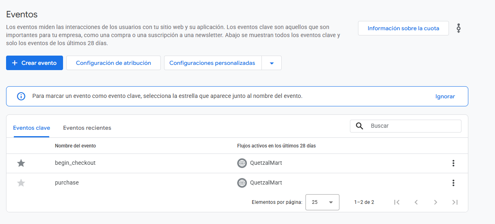
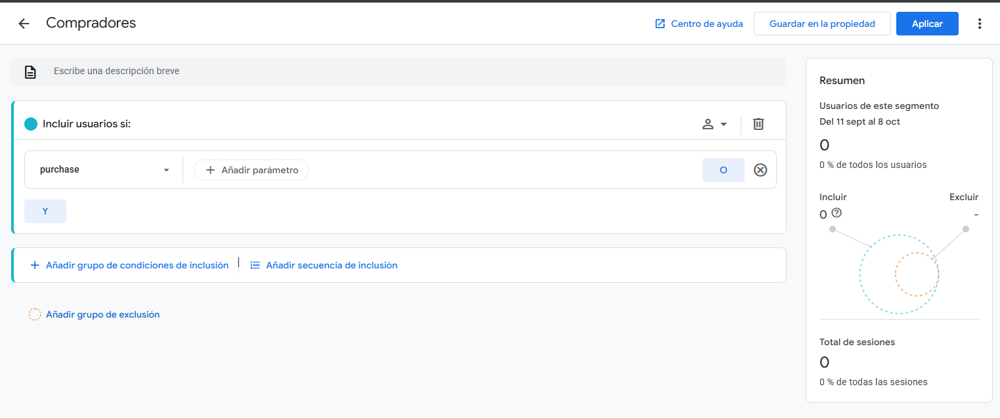
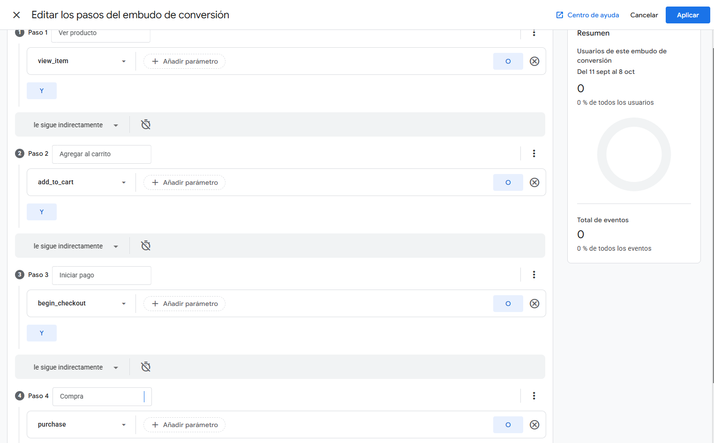
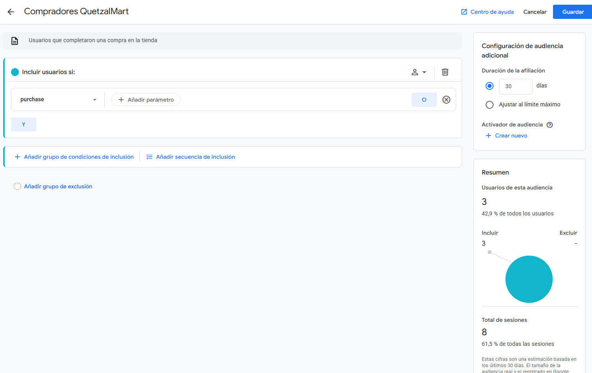
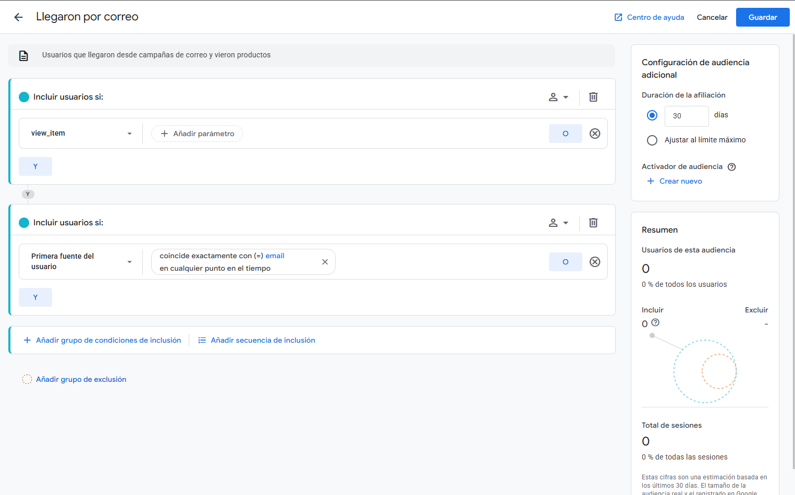
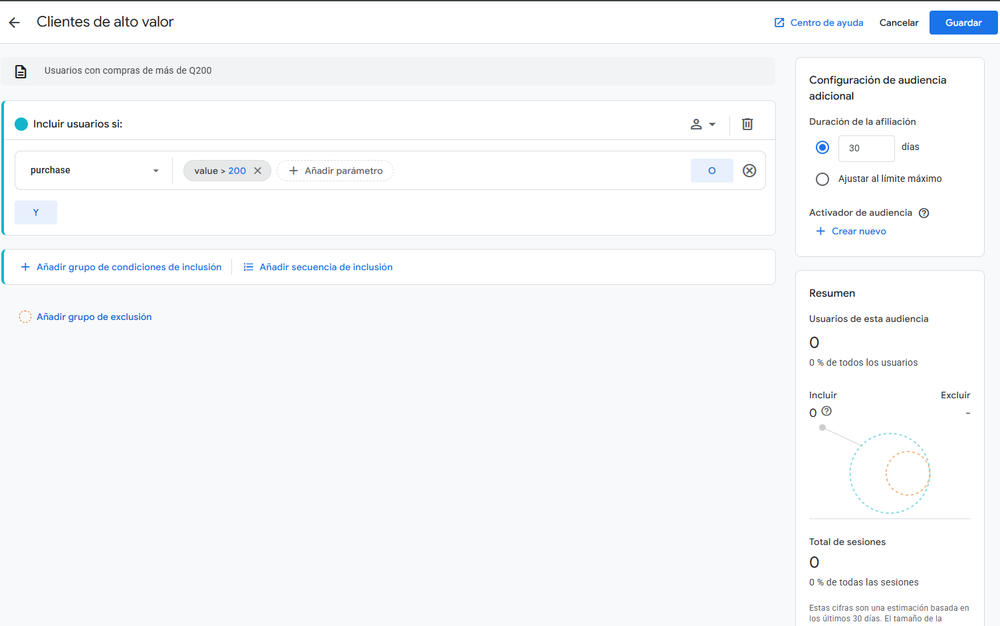
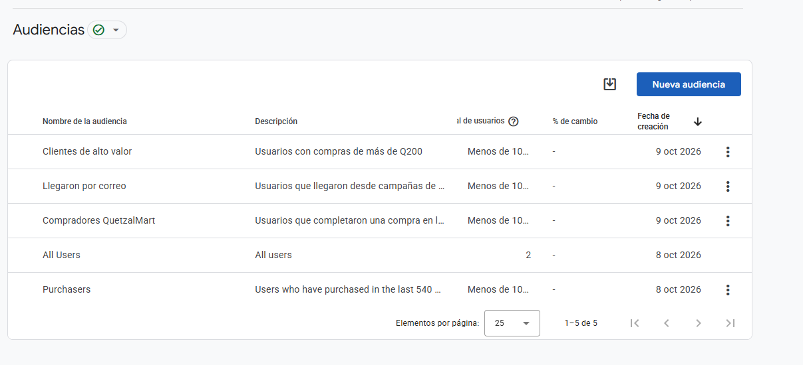

# Manual 3 · Inteligencia de negocio con Google Analytics 4


| Carné | Integrante |
|---|---|
| 202001814 | Naomi Rashel Yos Cujcuj |
| 202200252 | Néstor Enrique Villatoro Avendaño |
| 202202882 | Diego René Chen Teyul |
| 202200309 | Eduardo Angel Tubac Simón |
| 202103763 | Jennifer Yulissa Lourdes Taperio Manuel |
| 202200041 | Daniel Eduardo Velasquez Avila |

<!--
NOTAS INTERNAS (no se ven al exportar):
- Las imágenes apuntan a IMG/<archivo>.png. Si alguna extensión o nombre difiere, corregir la ruta en el enlace.
- Los comentarios "COMPLETAR" marcan cifras que salen de GA4 cuando los informes procesen datos (24-48 h tras el tráfico). Llenar las celdas vacías de las tablas y, si se quiere, citar la cifra en la lectura de negocio.
- Borrar todos los comentarios antes de la entrega si se desea.
-->

---

## Índice

1. Introducción y objetivo
2. Configuración de la medición
3. Indicadores clave
4. Tasa de conversión
5. Adquisición de usuarios
6. Productos más vendidos
7. Abandono de carrito
8. Segmentos
9. Exploraciones
10. Audiencias
11. Hallazgos y acciones correctivas
12. Conclusiones

---

## 1. Introducción y objetivo

QuetzalMart usa Google Analytics 4 (GA4) para convertir el comportamiento de sus clientes en la tienda en línea en decisiones comerciales concretas. La tienda corre sobre Odoo 18 Community y envía a GA4 los eventos del proceso de compra.

QuetzalMart es una cadena de supermercados nacida en Guatemala que abrió sucursales en México y El Salvador. Al abrir su canal en línea necesita saber qué productos interesan, de dónde llegan los clientes y en qué punto del proceso de compra se pierden. Este manual responde esas preguntas con los datos de GA4 y propone acciones correctivas.

Los objetivos del análisis son los cuatro que pide el enunciado:

- **Medir el éxito de las campañas de marketing:** comparar los canales de origen (Facebook, correo y Google) por usuarios, compras e ingresos.
- **Optimizar la experiencia del usuario:** detectar productos populares y puntos de fricción en el proceso de compra.
- **Segmentar a los clientes:** crear segmentos y audiencias para ofrecer promociones y contenidos relevantes.
- **Aumentar las conversiones:** proponer mejoras al sitio con base en los datos.

**Alcance de los datos.** El análisis usa el tráfico de prueba generado por el equipo y por el auxiliar sobre la tienda real, durante octubre de 2026. Los ingresos se expresan en quetzales (GTQ).

---

## 2. Configuración de la medición

La medición quedó activa con una propiedad GA4 conectada a la tienda de Odoo y un módulo propio que completa los eventos de comercio electrónico que Odoo no envía.

### 2.1 Propiedad y flujo de datos

| Elemento | Valor |
|---|---|
| Cuenta | QuetzalMart |
| Propiedad | QuetzalMart Tienda |
| Zona horaria y moneda | Guatemala · Quetzal (GTQ) |
| Flujo de datos | Web · "Tienda Odoo" · medición mejorada activa |
| ID de medición | `G-34SH2SJWGK` |
| Conexión con Odoo | Sitio web > Configuración > Ajustes > Google Analytics |
| Consentimiento | Barra de cookies desactivada, para que GA4 reciba a los usuarios en los informes |


*Figura 1. Propiedad QuetzalMart Tienda con zona horaria Guatemala y moneda GTQ.*


*Figura 2. Flujo de datos web con la URL de la tienda y el ID de medición.*


*Figura 3. ID de medición en los ajustes del sitio web de Odoo y barra de cookies desactivada.*

### 2.2 Eventos de comercio electrónico

Odoo 18 envía por sí mismo `view_item`, `add_to_cart` (desde la página del producto) y `purchase`. No envía `begin_checkout`, por eso se desarrolló el módulo propio `qm_ga4_ecommerce`, que además cubre el carrito y el pago.

| Evento | Cuándo se envía | Lo emite |
|---|---|---|
| `view_item` | Al abrir la página de un producto | Odoo 18 |
| `add_to_cart` | Al agregar un producto desde su página | Odoo 18 |
| `add_to_cart` | Al subir la cantidad dentro del carrito | `qm_ga4_ecommerce` |
| `view_cart` | Al abrir el carrito | `qm_ga4_ecommerce` |
| `remove_from_cart` | Al bajar la cantidad o eliminar una línea | `qm_ga4_ecommerce` |
| `begin_checkout` | Al entrar al checkout, una vez por pedido | `qm_ga4_ecommerce` |
| `add_shipping_info` | En la página de pago, con el método de envío | `qm_ga4_ecommerce` |
| `add_payment_info` | Al presionar *Pagar*, con el método de pago | `qm_ga4_ecommerce` |
| `purchase` | En la confirmación del pedido | Odoo 18 |

Todos los eventos llevan `currency` (GTQ), `value` e `items` (`item_id`, `item_name`, `item_category`, `price`, `quantity`). El evento `purchase` agrega `transaction_id`, `tax` y `shipping`.


*Figura 4. Módulo `qm_ga4_ecommerce` instalado en Odoo.*

### 2.3 Verificación de los eventos

Los eventos se verificaron de tres formas: las peticiones `collect` del navegador, el reporte en tiempo real y DebugView. Las pruebas se hicieron en Chrome sin bloqueadores, porque Brave, uBlock o AdBlock impiden que GA4 reciba los datos.


*Figura 5. Peticiones `collect` a GA4 con `en=view_item`, `en=add_to_cart`, entre otras.*


*Figura 6. Eventos de comercio electrónico en DebugView.*


*Figura 7. Usuarios y eventos en tiempo real.*

### 2.4 Eventos clave

`purchase` viene marcado por defecto como evento clave en GA4 y no se puede quitar. Se marcó también `begin_checkout`, para medir la conversión intermedia hacia el pago.



*Figura 8. `purchase` y `begin_checkout` marcados como eventos clave.*

---

## 3. Indicadores clave

Esta sección resume el desempeño de la tienda en el periodo analizado. Fuente: Informes > Monetización > Descripción general. El valor medio del pedido se calcula como ingresos totales entre número de compras.

<!-- COMPLETAR: llenar la columna Valor con las cifras de Monetización > Descripción general. -->

| Indicador | Valor |
|---|---|
| Usuarios activos |   |
| Sesiones |   |
| Compras |   |
| Ingresos totales (GTQ) |   |
| Valor medio del pedido (GTQ) |   |


*Figura 9. Ingresos totales en GTQ en el periodo analizado.*

**Lectura de negocio.** El número de compras y el ingreso total muestran el tamaño real del canal en línea, y el valor medio del pedido indica si el costo de envío de Q30 pesa demasiado en los pedidos pequeños. Si el valor medio es bajo, conviene incentivar pedidos mayores con un envío gratis a partir de un monto mínimo.

---

## 4. Tasa de conversión

La tasa de conversión mide qué proporción de los usuarios completa una compra.

```latex
\text{Tasa de conversión} = \frac{\text{usuarios con } purchase}{\text{usuarios totales}} \times 100
```

Fuente: Informes > Interacción > Eventos clave > `purchase`, columna *Tasa de eventos clave de usuario*, y la exploración de embudo (sección 9).

<!-- COMPLETAR: llenar la columna Valor. -->

| Medida | Valor |
|---|---|
| Usuarios con `purchase` |   |
| Usuarios totales |   |
| Tasa de conversión (%) |   |


*Figura 10. Tasa de conversión de la tienda.*

**Lectura de negocio.** De cada 100 usuarios que llegan a la tienda, solo una parte termina comprando. Mejorar el paso del embudo con mayor abandono es la forma más rápida de subir esta tasa, y la comparación por canal (sección 5) indica dónde invertir.

---

## 5. Adquisición de usuarios

La adquisición responde de dónde llegan los clientes. Para medirla, la tienda se promovió con tres enlaces con parámetros UTM, uno por canal.

| Canal | `utm_source` | `utm_medium` | `utm_campaign` |
|---|---|---|---|
| Facebook | `facebook` | `social` | `lanzamiento_tienda` |
| Correo | `email` | `email` | `bienvenida` |
| Google | `google` | `cpc` | `marca` |

Fuente: Informes > Adquisición > Adquisición de usuarios, por *Fuente / medio del primer usuario*.

<!-- COMPLETAR: llenar usuarios, compras e ingresos por fuente / medio. -->

| Fuente / medio | Usuarios nuevos | Compras | Ingresos (GTQ) |
|---|---|---|---|
| facebook / social |   |   |   |
| email / email |   |   |   |
| google / cpc |   |   |   |
| (direct) / (none) |   |   |   |


*Figura 11. Adquisición de usuarios por fuente y medio.*

**Lectura de negocio.** El canal que trae más usuarios no siempre es el que más compra. El canal con mejor tasa de conversión merece más presupuesto, aunque traiga menos visitas, y los canales con mucho tráfico y pocas compras requieren mejorar el mensaje o la página de destino.

---

## 6. Productos más vendidos

Fuente: Informes > Monetización > Compras de comercio electrónico, ordenado por *Artículos comprados*.

<!-- COMPLETAR: llenar el top 5 desde el informe. -->

| # | Producto | Categoría | Artículos comprados | Ingresos (GTQ) |
|---|---|---|---|---|
| 1 |   |   |   |   |
| 2 |   |   |   |   |
| 3 |   |   |   |   |
| 4 |   |   |   |   |
| 5 |   |   |   |   |


*Figura 12. Productos más vendidos por artículos comprados e ingresos.*

**Lectura de negocio.** Las categorías que dominan el ranking deben tener prioridad de inventario en las tres sucursales y presencia destacada en la tienda. Los productos muy vistos pero poco comprados son candidatos a promoción en la campaña de correo.

---

## 7. Abandono de carrito

El abandono de carrito mide cuántos usuarios dejan el proceso de compra antes de pagar.

```latex
\text{Abandono entre pasos} = \left(1 - \frac{\text{usuarios del paso siguiente}}{\text{usuarios del paso actual}}\right) \times 100
```

Fuente: exploración de embudo (sección 9) e Informes > Monetización > Recorrido de compra.

<!-- COMPLETAR: llenar usuarios y % de abandono desde el embudo. -->

| Paso | Evento | Usuarios | Abandono respecto al paso anterior |
|---|---|---|---|
| 1. Ver producto | `view_item` |   | — |
| 2. Agregar al carrito | `add_to_cart` |   |   |
| 3. Iniciar pago | `begin_checkout` |   |   |
| 4. Compra | `purchase` |   |   |


*Figura 13. Abandono entre el carrito y la compra.*

**Lectura de negocio.** El paso con mayor abandono señala dónde está la fricción. Si la pérdida se concentra entre el inicio del pago y la compra, conviene revisar el costo de envío, la obligación de registrarse y los métodos de pago. Si ocurre antes, el problema está en el catálogo o en el precio.

---

## 8. Segmentos

Los segmentos permiten analizar grupos específicos de usuarios o de eventos. Se crearon 3 de usuarios y 5 de eventos, guardados en la propiedad para usarlos en cualquier exploración.

### 8.1 Segmentos de usuarios (3)

| Segmento | Condición | Para qué sirve |
|---|---|---|
| Compradores | Usuarios con el evento `purchase` | Conocer cómo se comportan quienes sí compran |
| Abandonaron el carrito | Usuarios con `add_to_cart`, excluyendo a quienes tienen `purchase` | Medir el tamaño del abandono y preparar recuperación |
| Llegaron por campaña | *Primera fuente del usuario* igual a `facebook`, `email` o `google` | Comparar el comportamiento de quienes llegan por publicidad |



*Figura 14. Editor del segmento Compradores.*


*Figura 15. Editor del segmento Abandonaron el carrito, con su grupo de exclusión.*


*Figura 16. Editor del segmento Llegaron por campaña.*


*Figura 17. Lista con los 3 segmentos de usuarios.*

### 8.2 Segmentos de eventos (5)

| Segmento | Condición | Para qué sirve |
|---|---|---|
| Vistas de producto | Evento `view_item` | Medir el interés por los productos |
| Agregados al carrito | Evento `add_to_cart` | Medir la intención de compra |
| Inicio de pago | Evento `begin_checkout` | Medir quién llega al pago |
| Compras | Evento `purchase` | Medir las compras completadas |
| Eliminados del carrito | Evento `remove_from_cart` | Detectar productos que el cliente descarta |


*Figura 18. Lista con los 5 segmentos de eventos.*

**Lectura de negocio.** Comparar los segmentos de usuarios con los de eventos permite ver quién compra, quién abandona y por qué canal llegó cada grupo. El segmento *Llegaron por campaña* indica si la publicidad atrae compradores o solo visitas.

---

## 9. Exploraciones

Se crearon dos exploraciones con los segmentos de la sección 8.

### 9.1 Embudo de compra

Exploración de embudo con cuatro pasos: `view_item` → `add_to_cart` → `begin_checkout` → `purchase`, con el embudo abierto (los usuarios pueden entrar en cualquier paso), desglose por *Categoría de dispositivo* y los segmentos *Compradores*, *Abandonaron el carrito* y *Llegaron por campaña* en la comparación.



*Figura 19. Configuración de los pasos del embudo.*


*Figura 20. Embudo de compra con los segmentos aplicados.*

**Qué revela.** El embudo muestra el porcentaje de finalización de cada paso, dónde se pierde la mayor parte de los usuarios y si el comportamiento cambia entre escritorio y móvil.

### 9.2 Ventas por canal y producto

Exploración de forma libre con *Fuente / medio de la sesión* en las filas, *Nombre del artículo* en las columnas y como valores *Ingresos de artículos* y *Artículos comprados*, con los segmentos de eventos *Compras* y *Agregados al carrito*.


*Figura 21. Configuración de la exploración de forma libre.*


*Figura 22. Ingresos por fuente / medio y producto.*

**Qué revela.** La exploración cruza los canales con los productos para ver qué vende cada canal y cuáles productos se agregan al carrito sin llegar a comprarse.

---

## 10. Audiencias

Las audiencias agrupan usuarios que cumplen una condición para dirigirles campañas. Se crearon tres audiencias personalizadas, con duración de afiliación de 30 días. GA4 trae por defecto *All Users* y *Purchasers*, que no se cuentan entre las tres. La audiencia de abandono de carrito se maneja aparte y tampoco se cuenta.

Las audiencias acumulan usuarios desde su creación (9 de octubre de 2026), no hacia atrás.

| Audiencia | Condición | Uso en marketing |
|---|---|---|
| Compradores QuetzalMart | Evento `purchase` | Campañas de fidelización y recompra |
| Llegaron por correo | Evento `view_item` y *Primera fuente del usuario* igual a `email` | Medir y reforzar el canal de correo |
| Clientes de alto valor | Evento `purchase` con `value` mayor a 200 (Q200) | Promociones exclusivas para los mejores clientes |



*Figura 23. Editor de la audiencia Compradores QuetzalMart.*



*Figura 24. Editor de la audiencia Llegaron por correo.*



*Figura 25. Editor de la audiencia Clientes de alto valor.*



*Figura 26. Lista de audiencias creadas.*

**Lectura de negocio.** Cada audiencia se dirige a una campaña distinta: recompra para los compradores, refuerzo del canal de correo para quienes llegaron por él y promociones exclusivas para los clientes de mayor valor. Las audiencias se pueden exportar a campañas de publicidad para llegar a usuarios parecidos.

---

## 11. Hallazgos y acciones correctivas

Cada hallazgo se apoya en un dato de las secciones anteriores.

| # | Hallazgo | Evidencia | Acción correctiva |
|---|---|---|---|
| 1 | El paso con mayor abandono concentra la pérdida de clientes | Embudo de la sección 7 (Figura 13) | Simplificar ese paso: revisar costo de envío, registro obligatorio y métodos de pago |
| 2 | Hay productos muy vistos que casi no se compran | Ranking de la sección 6 y segmento Vistas de producto | Incluirlos en la campaña de correo con una promoción |
| 3 | Un canal convierte mejor que los demás | Tabla de adquisición de la sección 5 | Reasignar presupuesto de publicidad a ese canal |
| 4 | Un grupo de usuarios agrega al carrito y no compra | Segmento Abandonaron el carrito (sección 8) | Enviar un correo de recuperación de carrito |
| 5 | Los clientes de alto valor son pocos pero aportan buena parte de los ingresos | Audiencia Clientes de alto valor (sección 10) | Ofrecerles promociones exclusivas y envío preferente |
| 6 | El valor medio del pedido define el peso del envío | Indicadores de la sección 3 | Evaluar un envío gratis a partir de un monto mínimo |

---

## 12. Conclusiones

1. GA4 quedó integrado con la tienda de Odoo y registra el recorrido completo de compra (`view_item`, `add_to_cart`, `begin_checkout`, `purchase`), con `begin_checkout` aportado por el módulo propio `qm_ga4_ecommerce`.
2. Los indicadores de conversión, adquisición, ingresos, productos más vendidos y abandono de carrito permiten a QuetzalMart saber qué funciona y qué no en su canal en línea.
3. Los segmentos, las exploraciones y las audiencias convierten esos datos en acciones: recuperar carritos, reforzar el canal más rentable y premiar a los clientes de mayor valor.
4. Las acciones de la sección 11 cubren la competencia de proponer acciones correctivas con base en información del cliente, y apoyan la toma de decisiones de la dirección en la expansión a México y El Salvador.

<!-- COMPLETAR (opcional): en la conclusión 2, citar la cifra principal (tasa de conversión e ingresos). -->